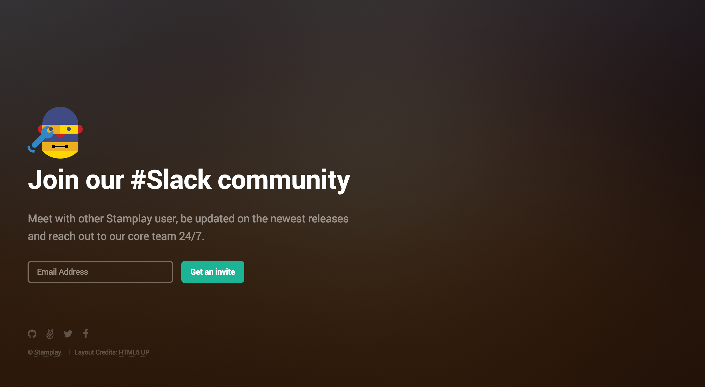

# slack-invites
At Stamplay, we love Slack. It's a communication tool that we can't live without. We started using for our internal communications but it didn't took too much before realizing that we could use it for our community as well.

Slack doesn’t allow people to sign up directly though. The team’s admin needs to invite people manually. Here, we'll show how we've built an app with Stamplay to transform Slack into a community platform.

This app will let you build a landing page to invite users to your Slack organization. You can point users to this page to fill in their emails and receive an invite (`http://APPID.stamplayapp.com`)



## How it works

This landing page back-end is built using just two components:

* [Webhook](https://stamplay.com/docs/rest-api#user)
* Slack


## Requirements

Go to [your account](http://editor.stamplay.com/apps) and create a new app.

## Configuring the components

### Webhook
Webhook component let you create API endpoints to receive data. We'll use this to capture users' email addresses. Creating a new endpoint using Webhook module is super simple:

* Go to Task -> Components and click on "Webhook"
* Type a name for the webhook URL, let's call it `"invites"` and hit Create


-----------------------
# Developing

First, clone this repository :

    git clone git@github.com:Stamplay/slack-invites
    
Or download it as a zip file
	
	https://github.com/Stamplay/slack-invites/archive/master.zip 

After launching `bower install` you need to upload the frontend files in your app by using the [CLI tool](https://github.com/Stamplay/stamplay-cli):

```js
cd your/path/to/slack-invites
stamplay init
/*
 * You'll be prompted to type the appId and API key of your Stamplay app
 */
stamplay deploy
```

-----------------------
